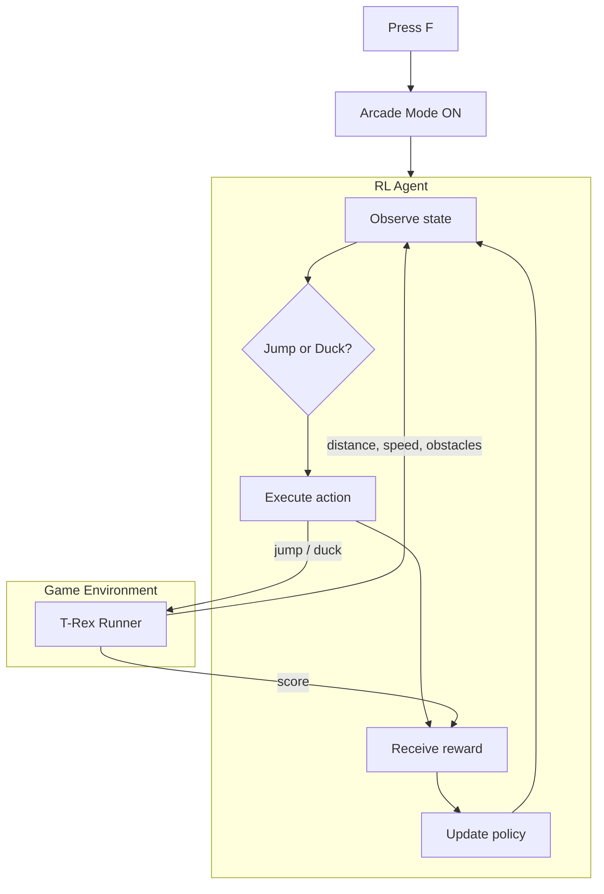

# T-Rex Runner — Reinforcement Learning Agent

A reinforcement learning agent trained to play the Chrome T-Rex Runner game autonomously. Forked from [devfolioco/t-rex-runner-game](https://github.com/devfolioco/t-rex-runner-game).

## Stack

- JavaScript — game engine (forked upstream)
- Reinforcement Learning — agent training
- Chrome dino game mechanics

## How it works

This project extends the open-source Chromium T-Rex Runner game with a reinforcement learning agent.



The agent observes the game state (obstacle distance, speed, ground position) and learns to jump and duck at the right moments through trial and error.

Press **F** to enable Arcade Mode, which activates the RL agent to play autonomously.

## My contribution

- Integrated a reinforcement learning agent into the game loop
- Added Arcade Mode toggle (F key) for autonomous play
- Configured the game environment for agent training
- Custom sprite and asset loading support

## Key features

- RL agent plays the game autonomously
- Manual play mode also available
- Arcade Mode toggle
- Custom sprite sheet upload support

## What this demonstrates

- Reinforcement learning integration with existing game engines
- Agent-environment interaction loop
- Game state observation and action mapping
- Fork-based contribution workflow

## Run locally

```bash
npm install
npm start
```

Or open `index.html` directly in a browser.
